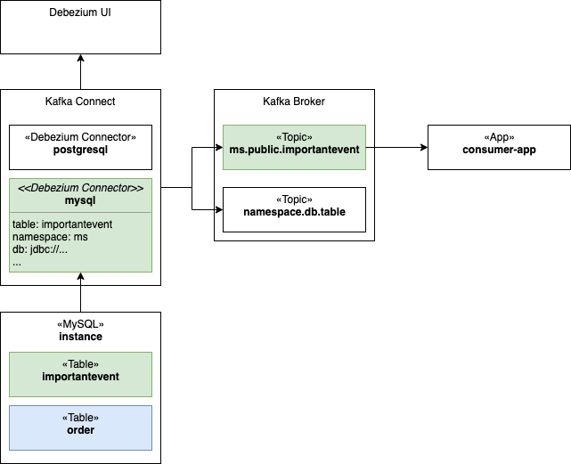

= Debezium 101
:author: Hafid Haddouti
:toc: macro
:toclevels: 4
:sectlinks:
:sectanchors:

toc::[]

== Overview

NOTE: in progress

Apache Kafka is one of the most widely used solutions for messaging and pub/sub use cases. Based on this, other solutions are developed, like link:https://debezium.io/[Debezium] for change data capture. Debezium determines changes in data stores like Databases and publish the changes in a topic using Kafka.

The following article handles a short introduction and showcase using the following components

* Strimzi (0.25.0): Solution to run Apache Kafka in Kubernetes/OpenShift
* Debezium (1.7.0.Final): Determine data changes, from a MySQL or PostgreSQL database instance

The <<Fig1>> gives an short overview of the relevant components for this scenario and solution.

[[Fig1, Figure 1]]
.Overview of Kafka and Debezium components

The `consumer-app` is a custom application consuming the topic and in this case, retrieving the events with the data modifications. In this scenario this consuming application is a Quarkus application.

== Install & Config

Install the relevant products

* Strimzi: install via Helm3 charts
** install strimzi in own namespace (here: `debezium-operator`) 
** watch separate namespaces (here: single namespace `debezium-test`) 

.Summary Strimzi installation
----
$ cd work
$ export STRIMZI_VERSION=0.25.0
$ git clone -b $STRIMZI_VERSION https://github.com/strimzi/strimzi-kafka-operator

$ cd strimzi-kafka-operator/helm-charts/helm3/strimzi-kafka-operator

$ oc new-project strimzi-test
$ oc new-project strimzi-operator

$ helm3 upgrade --install strimzi . \
 --set "watchNamespaces={strimzi-test}" \
 --namespace strimzi-operator

$ oc get pods -l name=strimzi-cluster-operator

NAME                                        READY   STATUS    RESTARTS   AGE
strimzi-cluster-operator-5f8c7fd7c4-m629h   1/1     Running   0          2m25s

----

* Install Kafka cluster and Zookeeper
** Strimzi provides link:https://github.com/strimzi/strimzi-kafka-operator/tree/0.25.0/examples/templates/cluster-operator[templates]

.Summary Strimzi template installation
----
$ oc create -f examples/templates/cluster-operator -n strimzi-operator

template.template.openshift.io/strimzi-connect created
template.template.openshift.io/strimzi-ephemeral created
template.template.openshift.io/strimzi-mirror-maker created
template.template.openshift.io/strimzi-persistent created
----

* Install a Kafka broker

.Summary Kafka broker installation
----
$ oc process strimzi-ephemeral \
 -p CLUSTER_NAME=broker \
 -p ZOOKEEPER_NODE_COUNT=1 \
 -p KAFKA_NODE_COUNT=1 \
 -p KAFKA_OFFSETS_TOPIC_REPLICATION_FACTOR=1 \
 -p KAFKA_TRANSACTION_STATE_LOG_REPLICATION_FACTOR=1 \
 | oc apply -n strimzi-test -f -

kafka.kafka.strimzi.io/broker created

$ c get pods -n strimzi-test

NAME                                      READY   STATUS    RESTARTS   AGE
broker-entity-operator-559b597ddf-xvmr7   3/3     Running   0          66s
broker-kafka-0                            1/1     Running   0          116s
broker-zookeeper-0                        1/1     Running   0          2m39s

$ oc get kafka -n strimzi-test

NAME     DESIRED KAFKA REPLICAS   DESIRED ZK REPLICAS   READY   WARNINGS
broker   1                        1                     True    True
----

* Prepare and install Kafka Connect image with link:https://debezium.io/documentation/reference/connectors/index.html[Debezium Connectors] using `KafkaConnect` (link:https://strimzi.io/docs/operators/latest/full/using.html#type-KafkaConnectSpec-reference[spec])

Since Strimzi 0.25.0 is the S2I solution to create a Kafka connect image with Debezium connectors deprecated and replaced by `KafkaConnect` build holding the information which plugins are needed.

.Summary Kafka Connect installation
----
$ oc apply -f scripts/kafka-connect-extended.yaml -n strimzi-test

kafkaconnect.kafka.strimzi.io/kafka-connect-db-cluster created

$ oc get pods

NAME                                                        READY   STATUS      RESTARTS   AGE
broker-entity-operator-559b597ddf-xvmr7                     3/3     Running     0          5h8m
broker-kafka-0                                              1/1     Running     0          5h9m
broker-zookeeper-0                                          1/1     Running     0          5h10m
kafka-connect-db-cluster-connect-6cbd4c7f56-5k5l8           1/1     Running     0          87s
kafka-connect-db-cluster-connect-build-1-build              0/1     Completed   0          2m8s
----

After a while Kafka Connect is built and connected to the Kafka broker.

* Install link:https://github.com/debezium/debezium-ui[Debezium-UI]

----
$ oc apply -f scripts/debezium-ui.yaml -n strimzi-test

service/debezium-service created
configmap/debezium-service-config created
deployment.apps/debezium-service created
route.route.openshift.io/debezium-route created

$ oc get pods

NAME                                                        READY   STATUS      RESTARTS   AGE
broker-entity-operator-559b597ddf-xvmr7                     3/3     Running     0          5h8m
broker-kafka-0                                              1/1     Running     0          5h9m
broker-zookeeper-0                                          1/1     Running     0          5h10m
debezium-service-7d988bdd4-r9vz4                            1/1     Running     0          4h10m
kafka-connect-db-cluster-connect-6cbd4c7f56-5k5l8           1/1     Running     0          87s
kafka-connect-db-cluster-connect-build-1-build              0/1     Completed   0          2m8s

$ oc get routes

NAME             HOST/PORT                                        PATH   SERVICES           PORT    TERMINATION   WILDCARD
debezium-route   debezium-route-strimzi-test....appdomain.cloud          debezium-service   <all>   passthrough   None

----

Afterwards the Debezium UI is available, but no connectors are installed.

But the wizard provides the possibility to register a connector

Now the following main components are successfully installed

* Strimzi
** Kafka Broker
** Zookeeper
** Kafka Connect with Debezium Connector for PostgreSQL and MySQL
* Debezium UI

== Action

With the running Kafka and Debezium components let's configure the data event capture for a MySQL or PostgreSQL database using the Debezium UI or direct via REST API to the Kafka Connect API.
Prerequisite is a running DB instance.

----
oc exec -i -c kafka broker-kafka-0 -n strimzi-test -- curl -X POST \
    -H "Accept:application/json" \
    -H "Content-Type:application/json" \
    http://kafka-connect-postgresql-cluster-connect-api.strimzi-test:8083/connectors -d @- <<'EOF'

{
    "name": "mysql-connector-test-01",
    "config": {
        "connector.class": "io.debezium.connector.mysql.MySqlConnector",
        "tasks.max": "1",
        "database.hostname": "mysql",
        "database.port": "3306",
        "database.user": "debezium",
        "database.password": "dbz",
        "database.server.id": "184054",
        "database.server.name": "dbserver1",
        "database.include.list": "inventory",
        "database.history.kafka.bootstrap.servers": "broker-kafka-bootstrap.strimzi-test:9092",
        "database.history.kafka.topic": "schema-changes.mysql-test"
    }
}
EOF
----

Now modify (add, update) data rows in the table and verify the published messages on the Kafka topic.
The payload contains the previous and new data object in the `payload.before` and `payload.after` object.

[source,json]
----
// ...
"payload": {
    "before": {
        "id": 15,
        "title": "event1",
        "event_state": "1",
        "created_at": "2021-10-16T18:34:32Z"
    },
    "after": {
        "id": 15,
        "title": "event1",
        "event_state": "2",
        "created_at": "2021-10-16T19:11:14Z"
    }
    // ...
}
----

.List existing topics
----
oc exec -it broker-kafka-0 -n strimzi-test -- /opt/kafka/bin/kafka-topics.sh \
    --bootstrap-server localhost:9092 --list
----

.Listen on messages from a given topic
----
oc exec -it broker-kafka-0 -n strimzi-test -- /opt/kafka/bin/kafka-console-consumer.sh \
    --bootstrap-server localhost:9092 \
    --from-beginning \
    --property print.key=true \
    --topic mc7.sampledb.ImportantEvents
----

== Summmary

tbd

== References

* link:https://debezium.io/[Debezium]
* link:https://quarkus.io/guides/kafka[Quarkus: Kafka Reference Guide]
* link:https://strimzi.io/docs/operators/latest/full/deploying.html#deploy-tasks_str[Deploy Strimzi]
* link:https://github.com/debezium/debezium-ui[Debezium UI]

== License

This article and project are licensed under the Apache License, Version 2.
Separate third-party code objects invoked within this code pattern are licensed by their respective providers pursuant
to their own separate licenses. Contributions are subject to the
link:https://developercertificate.org/[Developer Certificate of Origin, Version 1.1] and the
link:https://www.apache.org/licenses/LICENSE-2.0.txt[Apache License, Version 2].

See also link:https://www.apache.org/foundation/license-faq.html#WhatDoesItMEAN[Apache License FAQ]
.